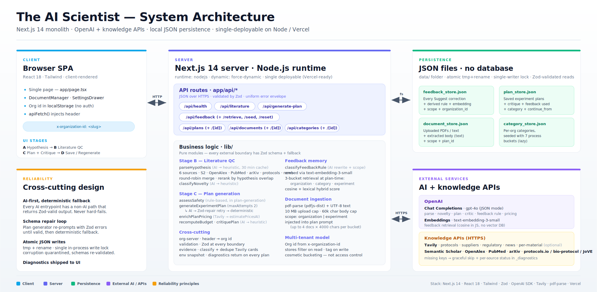
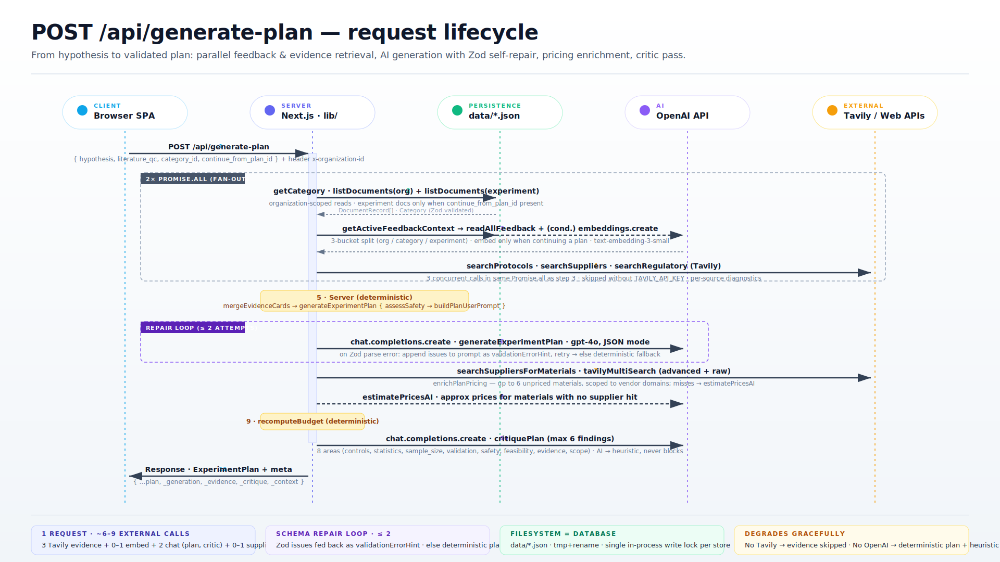

# The AI Scientist — Technical Documentation

> From scientific hypothesis to operational experiment plan.
> Next.js 14 monolith · OpenAI + knowledge APIs · local JSON persistence · single-deployable on Node / Vercel.

## System Architecture

The diagram below shows the four runtime layers (Client, Server, Persistence, External services) and how data flows between them.



> **Note for GitHub viewers:** if the diagram above appears blank, open [`architecture.html`](architecture.html) in a browser, or view the high-resolution raster at [`architecture.png`](architecture.png).

---

## Request Lifecycle — `POST /api/generate-plan`

The sequence diagram below traces the full lifecycle of a single plan-generation request: parallel evidence retrieval, the Zod-repair loop, pricing enrichment, and the AI critic pass.



---

## Repository layout

```
Skill4People/
├── the-ai-scientist/          # Next.js 14 application
│   ├── app/
│   │   ├── page.tsx           # Single-page SPA (hypothesis → literature QC → plan)
│   │   ├── layout.tsx
│   │   └── api/               # All route handlers
│   │       ├── health/        # GET  /api/health
│   │       ├── literature/    # POST /api/literature
│   │       ├── generate-plan/ # POST /api/generate-plan
│   │       ├── feedback/      # GET/POST /api/feedback (+ /retrieve /seed /reset)
│   │       ├── plans/         # GET/POST /api/plans  · GET/PATCH/DELETE /api/plans/[id]
│   │       ├── documents/     # GET/POST /api/documents · GET/PATCH/DELETE /api/documents/[id]
│   │       └── categories/    # GET/POST /api/categories · GET/PATCH/DELETE /api/categories/[id]
│   ├── components/
│   │   ├── DocumentManager.tsx   # Upload/manage PDFs and text files per org / experiment
│   │   └── SettingsDrawer.tsx    # Org settings, category management, API status
│   ├── lib/                   # Pure business-logic modules
│   │   ├── schemas.ts         # All Zod schemas (single source of truth for types)
│   │   ├── plan-generation.ts # Core: assessSafety → AI plan → Zod-repair → fallback
│   │   ├── plan-prompts.ts    # System + user prompt builders
│   │   ├── plan-critic.ts     # AI critic pass (6 findings, 8 areas) + heuristic fallback
│   │   ├── plan-store.ts      # Atomic JSON reads/writes for saved plans
│   │   ├── literature.ts      # 6-source parallel search + round-robin merge + rerank
│   │   ├── feedback-retrieval.ts # 3-bucket retrieval (org / category / experiment)
│   │   ├── feedback-store.ts  # Atomic JSON reads/writes for feedback
│   │   ├── feedback-prompts.ts   # AI rule classification + heuristic fallback
│   │   ├── document-store.ts  # Atomic JSON reads/writes for uploaded documents
│   │   ├── document-extract.ts   # pdf-parse + UTF-8 extraction, 60 k char cap
│   │   ├── category-store.ts  # 7 built-in process categories, lazy seeding
│   │   ├── evidence.ts        # Classify + dedupe Tavily evidence cards
│   │   ├── material-pricing.ts   # Per-material Tavily search + AI approximation
│   │   ├── material-enrichment.ts # Match evidence cards to materials
│   │   ├── budget.ts          # Deterministic budget recomputation
│   │   ├── safety.ts          # Rule-based safety flag detection
│   │   ├── openai.ts          # OpenAI client, chatCompletionsJson, safeEmbedding, cosine
│   │   ├── tavily.ts          # Tavily multi-search helper
│   │   ├── semantic-scholar.ts  # Semantic Scholar API search
│   │   ├── openalex.ts        # OpenAlex API search
│   │   ├── pubmed.ts          # PubMed E-utilities search
│   │   ├── arxiv.ts           # arXiv Atom search
│   │   ├── news-search.ts     # Tavily-backed recent news / preprint search
│   │   ├── protocol-search.ts # Tavily-backed protocol-repository search
│   │   ├── supplier-search.ts # Tavily-backed supplier evidence search
│   │   ├── regulatory-search.ts # Tavily-backed regulatory search
│   │   ├── org-server.ts      # Read x-organization-id header from request
│   │   ├── org-context.ts     # Client-side org id helpers
│   │   ├── validation.ts      # Zod wrapper, uniform JSON error envelope
│   │   ├── env.ts             # Env snapshot + Vercel runtime info
│   │   ├── ids.ts             # Typed ID generators
│   │   ├── utils.ts           # jaccard, tokenize, truncate, nowIso
│   │   └── api-client.ts      # Client-side apiFetch (injects x-organization-id)
│   ├── data/                  # Local JSON stores (git-tracked for demo seeding)
│   │   ├── feedback_store.json
│   │   ├── plan_store.json
│   │   ├── document_store.json
│   │   └── category_store.json
│   └── scripts/
│       ├── smoke-test.ts      # Basic API smoke test
│       ├── smoke-feedback.ts  # Feedback pipeline smoke test
│       ├── smoke-tavily.ts    # Tavily connectivity check
│       ├── seed-feedback.ts   # Populate feedback_store with demo rules
│       └── reset-feedback.ts  # Clear feedback_store
└── docs/                      # This folder — diagrams + pitch deck
    ├── README.md              # This file
    ├── architecture.svg       # System architecture diagram (2200×1080, source of truth)
    ├── architecture.png       # Rasterised architecture (4400×2160 @ 2×)
    ├── sequence-generate-plan.svg  # generate-plan request lifecycle
    ├── architecture.html      # Browser wrapper for both SVGs
    ├── build_deck.py          # python-pptx pitch-deck generator
    ├── GF_sh_AI_scientist_Deck*.pptx # Rendered pitch decks
    ├── GF_sh_AI_scientist_demo_script.md
    ├── GF_sh_AI_scientist_technical_script.md
    └── 04_The_AI_Scientist.docx.md  # Original challenge brief
```

---

## API Routes

| Method | Route | Description |
|--------|-------|-------------|
| `GET` | `/api/health` | Server + API-key status, env diagnostics |
| `POST` | `/api/literature` | Parse hypothesis, 6-source literature search, novelty signal |
| `POST` | `/api/generate-plan` | Full plan generation pipeline (see sequence diagram above) |
| `GET` | `/api/feedback` | List all feedback rules for the active organisation |
| `POST` | `/api/feedback` | Save a scientist correction and derive a reusable rule |
| `POST` | `/api/feedback/retrieve` | Retrieve semantically relevant feedback for a hypothesis |
| `POST` | `/api/feedback/seed` | Seed demo feedback rules (development only) |
| `POST` | `/api/feedback/reset` | Clear all feedback rules (development only) |
| `GET` | `/api/plans` | List saved experiment plans for the active organisation |
| `POST` | `/api/plans` | Save or upsert a generated plan |
| `GET/PATCH/DELETE` | `/api/plans/[id]` | Fetch, update name, or delete a saved plan |
| `GET` | `/api/documents` | List uploaded documents (filterable by scope / plan_id) |
| `POST` | `/api/documents` | Upload and extract text from a PDF or plain-text file |
| `GET/DELETE` | `/api/documents/[id]` | Fetch or delete a document |
| `GET` | `/api/categories` | List experiment categories for the active organisation |
| `POST` | `/api/categories` | Create a custom category |
| `PATCH/DELETE` | `/api/categories/[id]` | Rename or remove a custom category |

All route inputs are validated with Zod. Error responses follow a uniform `{ error: { code, message, recoverable } }` envelope.

---

## Environment Variables

| Variable | Required | Default | Purpose |
|----------|----------|---------|---------|
| `OPENAI_API_KEY` | optional | — | Enables AI plan generation, critique, hypothesis parsing, feedback classification, and embeddings |
| `OPENAI_MODEL` | optional | `gpt-4o` | Chat-completion model used for all AI calls |
| `TAVILY_API_KEY` | optional | — | Enables protocol, supplier, regulatory, news, and per-material evidence searches |
| `SEMANTIC_SCHOLAR_API_KEY` | optional | — | Higher rate limits for Semantic Scholar literature search |
| `ENABLE_DEMO_FALLBACK` | optional | `true` | When `false`, disables deterministic fallback plans |

Missing keys do not crash the app. Every AI entry-point has a deterministic fallback that returns a Zod-valid output and surfaces a diagnostic in the UI.

---

## Key Design Principles

### AI-first, deterministic fallback
Every external AI call has a non-AI code path that produces a structurally valid result. The system never hard-fails on a missing key or API error.

### Schema repair loop
`generateExperimentPlan` (`lib/plan-generation.ts`) runs up to **2 attempts**. If the LLM response fails Zod validation, the parse errors are appended to the prompt as a `validationErrorHint` and the call is retried. Only after both attempts fail does the code fall back to a deterministic plan.

### 3-bucket feedback retrieval
Feedback is partitioned at save-time into three scopes:

| Scope | Applied when |
|-------|--------------|
| `organization` | Every plan generated by the org (always injected) |
| `category` | Every plan in the selected experiment category |
| `experiment` | Only when continuing from a specific saved plan |

Retrieval combines cosine similarity (via `text-embedding-3-small`) and a lexical hybrid score (domain, experiment-type, Jaccard overlap, severity).

### Atomic JSON writes
All four JSON stores use a **tmp → rename** pattern with a single in-process write lock per store. Corrupted or schema-invalid reads are quarantined rather than crashing the server.

### Document injection
Uploaded PDFs and plain-text files are extracted (60 000 char cap) and injected into the plan-generation prompt in two buckets:
- **organisation-scope** documents — injected into every plan for that org
- **experiment-scope** documents — injected only when branching from the linked saved plan

Up to 4 documents × 4 000 chars per bucket.

---

## Development Setup

```bash
cd the-ai-scientist
npm install
cp .env.example .env.local   # then fill in API keys
npm run dev
```

Open [http://localhost:3000](http://localhost:3000).

### Available scripts

```bash
npm run dev            # start dev server
npm run build          # production build
npm run typecheck      # tsc --noEmit
npm run lint           # ESLint
npm run smoke          # basic API smoke test
npm run smoke:feedback # feedback pipeline smoke test
npm run smoke:tavily   # Tavily connectivity check
npm run feedback:seed  # populate demo feedback rules
npm run feedback:reset # clear all feedback rules
npm run deploy:prod    # vercel deploy --prod with git SHA injection
```

---

## Regenerating the Architecture PNG

Online SVG-to-PNG converters drop text because they lack the system fonts the SVG requests (`Inter`, `Segoe UI`, `Helvetica Neue`). Use **headless Microsoft Edge** instead, which resolves the font stack against locally-installed Windows fonts (Segoe UI ships with every Windows install):

```powershell
$edge = "C:\Program Files (x86)\Microsoft\Edge\Application\msedge.exe"
$wrap = "docs\_render.html"

@"
<!DOCTYPE html><html><head><meta charset='UTF-8'><style>
  html,body{margin:0;padding:0;background:#fff}
  body{width:2200px;height:1080px;overflow:hidden}
  object{display:block;width:2200px;height:1080px}
</style></head><body>
<object type='image/svg+xml' data='architecture.svg'></object>
</body></html>
"@ | Set-Content $wrap -Encoding UTF8

$dst = (Join-Path (Resolve-Path "docs").ProviderPath "architecture.png")
$url = "file:///" + ((Resolve-Path $wrap).ProviderPath -replace "\\","/")
& $edge --headless=new --disable-gpu --hide-scrollbars `
        --window-size=2200,1080 --force-device-scale-factor=2 `
        --screenshot="$dst" $url
Remove-Item $wrap
```

Output: **4400 × 2160 px** (`--force-device-scale-factor=2`), sharp at 4K. Swap `architecture.svg` → `sequence-generate-plan.svg` and rename `--screenshot` to regenerate the sequence diagram.

### SVG card geometry reference

| Card | `x` | `width` | Notes |
|------|-----|---------|-------|
| Browser SPA | 60 | 480 | |
| Reliability | 60 | 480 | y = 620 |
| Server (Next.js) | 620 | 820 | |
| Persistence | 1520 | 620 | |
| External services | 1520 | 620 | y = 620 |

Canvas: `viewBox 0 0 2200 1080`. Gap between adjacent cards is **80 px** — needed for the double-headed arrows (`HTTP` / `fs` / `HTTPS`) to render both arrowheads cleanly.

---

## Regenerating the Pitch Deck

```powershell
cd docs
python build_deck.py
```

`build_deck.py` uses `python-pptx` to write `GF_sh_AI_scientist_Deck.pptx` (6 slides) next to itself. Edit text, colour, and geometry directly in the script rather than in the `.pptx` file.
